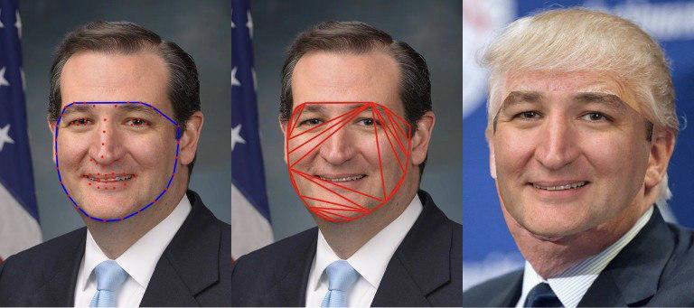

<html>
<head>
<title>Face Swap Projektdokumentation</title>

</head>
<body>
<blockquote>

<h1>Face Swapping in Echtzeit</h1>

<b>Projektdokumentation eines Projekts für Interactive Systems</b>

Gruppe: Vladislav Chirkov, Mikhail Sekerin, Anton Sorokin

Hier finden Sie:

<ul>
  <li><a href=#idee>Projektidee</a></li>
  <li><a href=#umsetzung>Umsetzung</a></li>
  <li><a href=#auswertung>Auswertung</a></li>
  <li><a href=#quellen>Quellen</a></li>
</ul>
<h3><a name="idee">1. Projektidee</a></h3>

 Die Hauptidee dieses Projektes ist die Face Recognition in Echtzeit. Dieses Thema ist sehr umfangreich und verwendet nicht nur in professionellen Bereichen, sondern im Bereich der Unterhaltung auch. Zum Beispiel es hilft gute Fotografie machen oder nach Verbrechern durch Videoüberwachung suchen. Aber Unterhaltungsbereich ist auch interessant und nützlich. Große Unternehmen wie Facebook, Apple nutzen diese Technologie in beiden Bereichen. Zum Beispiel hat Apple letztes Jahr FaceID präsentiert. Mit der Hilfe von FaceID kann man ihrer iPhone entsperren oder Animoji machen. Animoji ist eine  Art von Masken, die waren zuerst  in den Jahr 2016 in MSQRD App genutzt, danach wurde diese Applikation von Facebook gekauft und in Instagram verwendet. Im Rahmen dieses Projekts wollen wir Real Time Face Swapping entwicklen. Die Hauptaufgabe ist die Implementation der Face-Swap-Funktion in Echtzeit. Dafür muss man die folgende Aufgaben lösen:
<ol>
  <li>Grenze des Gesichtes herausfinden</li>
  <li>Farbe korregieren</li>
  <li>Ort der empfangenen Mask im Bild ermitteln</li>
</ol>

Um das Projekt zu implementieren, war die Python-Sprache und der Satz von Bibliotheken benutzt, die unten beschrieben werden. 

<h3><a name="umsetzung">2. Umsetzung</a></h3>

 Um dieses Programm zu verwenden, benötigt man eine Webcam und zwei Gesichter, die in die Kamera sehen. Die Geometrie der beiden Gesichter ist sehr unterschiedlich und daher muss man das Quellgesicht etwas verformen, so dass es das Zielgesicht abdeckt, aber man muss auch sicherstellen, dass es nicht bis zur Unkenntlichkeit verformt werden.
Um dies zu erreichen, sucht man die Orientierungspunkte in den beiden Gesichter mit Hilfe von dlib. Dlib ist einfach eine Bibliothek, die einen vortrainierten Detektor hat. Dieser Detektor findet die Positionen von 68 Punkte auf dem Gesicht. Ein Beispiel kann man auf dem Bild sehen.

 

  
  
Abbildung 1: Landmark Detection

  
  
Abbildung 2: Landmark Detection (Python-Sourcecode))

 Der nächste Schritt ist eine Delaunay-Triangulation dieser Punkte. Dadurch kann man das Gesicht in kleinere Teile aufteilen. Die Triangulation bedeutet eine Unterteilung der Ebene in Dreiecke mit den Punkten als Eckpunkte. Auf dem linken Bild sieht man eine Reihe von Punkten und rechts die Triangulation. Eine Reihe von Punkten kann viele mögliche Triangulationen haben, aber in einer Delaunay-Triangulation werden die Dreiecke so gewählt, dass innerhalb des Kreises, auf dem die drei Dreieckspunkte liegen (Umkreis des Dreiecks), keine anderen Punkte enthalten sind. 

  
  
Abbildung 3: Delaunay-Triangulation

  
  
Abbildung 4: Zwischenergebnis

  
  
Abbildung 5: Delaunay-Triangulation (Python-Sourcecode)

Am Ende der Ausrichtung übertragt man die Dreiecke des Quellgesicht auf dem Zielgesicht. Wie man jedoch rechts sehen kann, sieht das Ergebnis kaum unnatürlich aus. Der nächste Schritt zeigt, wie man die beiden Bilder besser kombinieren kann. Damit es natürlich aussieht, verwendet man "Seamless Cloning". Seamless Cloning ist eines der neuen Features von OpenCV 3. Mit dieser neuen Funktion kann man ein Objekt aus einem Bild kopieren und in ein anderes Bild einfügen, um eine Komposition zu erstellen, die nahtlos und natürlich aussieht. Dazu wird die OpenCV-Funktion "seamlessClone" verwendet. Die folgenden Argumente werden verwendet:

<ol>
<li>Quellbild, das in das Zielbild geklont wird</li>
<li>Zielbild, in das das Quellbild geklont wird</li>
<li>Eine grobe Maske um das Objekt, daswir klonen wollen.</li>
<li>Position der Mitte des Quellbildes im Zielbild.</li>
<li>Klonierungsmethode: Mixed oder Normal Cloning.</li>
</ol>
Beim "Normal Cloning" bleibt die Textur (der Gradient) des Quellbildes in der geklonten Region erhalten. Beim "Mixed Cloning" wird die Textur (der Gradient) der geklonten Region durch eine Kombination der Quell- und Zielbilder bestimmt. Nach allen Manipulationen wird das folgende Ergebnis erhalten, das auf der Abbildung dargestellt wird. Diese Funktion wird in der Methode "swap" benutzt, wo die Swap-Funktion implementiert wurde.

  
  
Abbildung 6: Seamless-Cloning Beispiel

  
  
Abbildung 7: Swap-Funktion mit Seamless-Cloning (Python-Sourcecode)

  
  
Abbildung 8: Hauptmethode (Python-Sourcecode)

 

Damit das Programm funktioniert, muss man alle diese Schritte in Echtzeit durchführen. Als Ergebnis erhalten wir eine Face Swapping in Enchtzeit. Das Ergebnis und die Sourcecode ist auf der Abbilding 8 dargestellet.

<h3><a name="auswertung">3. Auswertung</a></h3>
Im Rahmen dieses Projekts wurde das Programm zur Realisierung von Face Swap in Echtzeit entwickelt. In der Abbildung 9 kann man deutlich sehen, wie die ersetzten Gesichte aussehen. Die Genauigkeit der Ersetzung ist hoch genug, aber leider erfordert diese Anwendung ziemlich viel Rechenleistung bei der Verwendung einer hochauflösenden Kamera, weil sie in der Python-Programmiersprache geschrieben ist. Eine Lösung für dieses Problem ist die Implementierung in mithilfe von C++ oder die Nutzung von GPU (beispielweise CUDA für Nvidia).

  

  
  
Abbildung 9: Ergebnis

<h3><a name="quellen">Quellen</a></h3>
<ul>
  <li><a href=https://www.asozykin.ru/deep_learning/2017/08/11/foto-verification-with-dlib>Erkennen einer Person in einem Foto mithilfe von dlib</a></li>
  <li><a href=http://www.learnopencv.com/seamless-cloning-using-opencv-python-cpp/>Seamless Cloning using OpenCV</a></li>
  <li><a href=https://github.com/hrastnik/FaceSwap>Face Swap (Github)</a></li>
  <li><a href=http://www.learnopencv.com/face-swap-using-opencv-c-python/>Face Swap using OpenCV and Python</a></li>
  <li><a href=https://habrahabr.ru/post/306568/>Moderne Gesichtserkennung mit intensivem Training</a></li>
  <li><a href=https://matthewearl.github.io/2015/07/28/switching-eds-with-python/>Face swapping with Python, dlib, and OpenCV</a></li>
  <li><a href=http://www.irisa.fr/vista/Papers/2003_siggraph_perez.pdf>Poisson Image Editing, Microsoft Research UK (PDF)</a></li>
</ul>
</blockquote>
</body>
</html>